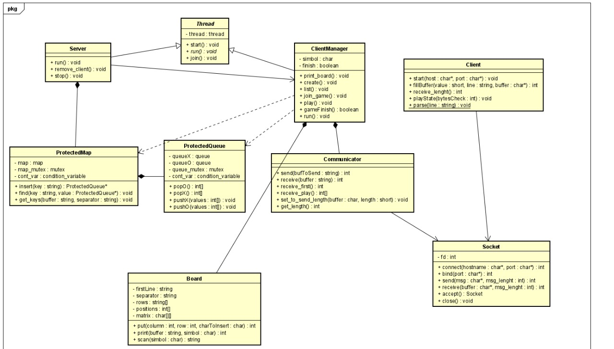

# Taller de Programación - Cátedra Veiga - FIUBA
# Trabajo Práctico III

<h2 align="right">Juan Bautista Xifro</h2>
<h2 align="right">101717</h2>

## Introducción
Este ultimo trabajo practico individual pide crear una comunicación multi cliente/servidor utilizando multithreading para correr partidas de ta-te-ti entre 2 clientes.
La idea de este tp es unir lo aprendido en el tp1 (cliente servidor, TDA) con lo aprendido en el tp2 (threads, ownership, move semantics).

## Diseño

<br><p align="center"></p>

El main del servidor crea un thread ```Server``` el cual se encarga de *bindearse* y aceptar clientes y cuando no esta bloquedo en *accept* realiza trabajo de limpieza.
Este thread cuando acepta clientes, por su parte, crea 1 thread, ```ClientManager```, por cada cliente que acepta. Esta clase se encarga de tener la conversación con el cliente
y por lo tanto es quien maneja los inputs y outputs del juego. Para esto se ayuda de un ```ProtectedMap``` el cual se inicializó en ```Server``` y es donde se guardan todas las partidas
que existen en el server, ```ProtectedQueue``` se utiliza para que dos clientes puedan jugar entre ellos, esta clase se encarga de ser una queue bloqueante la cual cuando un cliente
hace su jugada ésta es mandada a la queue para que el otro thread ```ClientManager``` pueda hacer un pop y obtener esa jugada. Por ultimo existe la clase ```Board``` la cual
es la encargada de mantener el tablero actualizarse por cada jugada y escanearse para informar si alguien gano o se empato.

Del lado del cliente esto es mas sencillo ya que solo se utiliza una clase ```Client``` la cual se encarga de manejar la comunicación del cliente servidor de parte del cliente.

Ambos *cliente/servidor* hacen uso de la carpeta common_src la cual tiene la clase ```Socket``` y ```SocketException``` que sirven para la conexión, comunicación, cierre y manejo de errores
de los sockets que tanto cliente como servidor hacen uso.

## Diagrama de secuencia

<br><p align="center"></p>

## Conclusión
En este tp pude darme cuenta de lo mucho que se puede hacer utilizando estos conceptos que se enseñaron hasta ahora. Si bien es un juego muy simple la idea de que pueda
manejar varios clientes al mismo tiempo hizo darme cuenta que se pueden realizar muchas cosas. Esto más los conceptos *teóricos* como el ownership y TDA hacen de un código mucho mas limpio y entendible.
